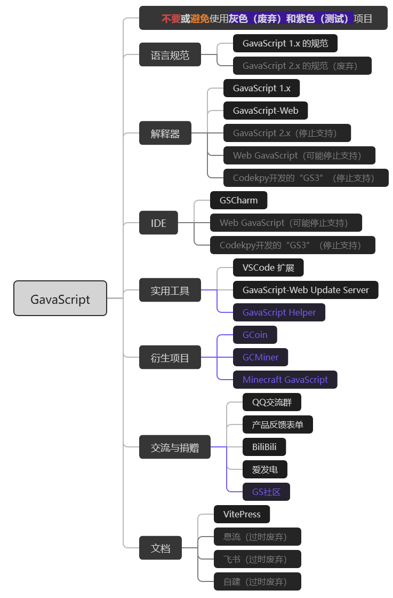

# 快速开始

## 0. 产品概况
GavaScript 开发团队制定了GavaScript语言规范，还为GavaScript语言制作了解释器、IDE等产品

下面的思维导图能让你快速理清它们的关系
::: details 点击查看图片

:::
## 1. 下载解释器
### 1.1 各解释器简介
GS有许多解释器可供您使用，如GS1、GS-Web。大多数都使用`GavaScript 1.x的语法规范`，只有环境不同导致的部分语法不同，但是目前GS1的完成度是最高的，所以建议大家用GS1，如果想体验类似Python2语法可以去试试GS2。

PS：`@hhcl233`已经在肝GS-Web了，可能很快就完善？

### 1.2 下载
- QQ群下载
- Gitee下载
- 网盘下载
- 官网下载（关闭中）

### 1.3 使用

详见各解释器文档
- [GS1-CLI](/GavaScript%201.x/CLI.md)